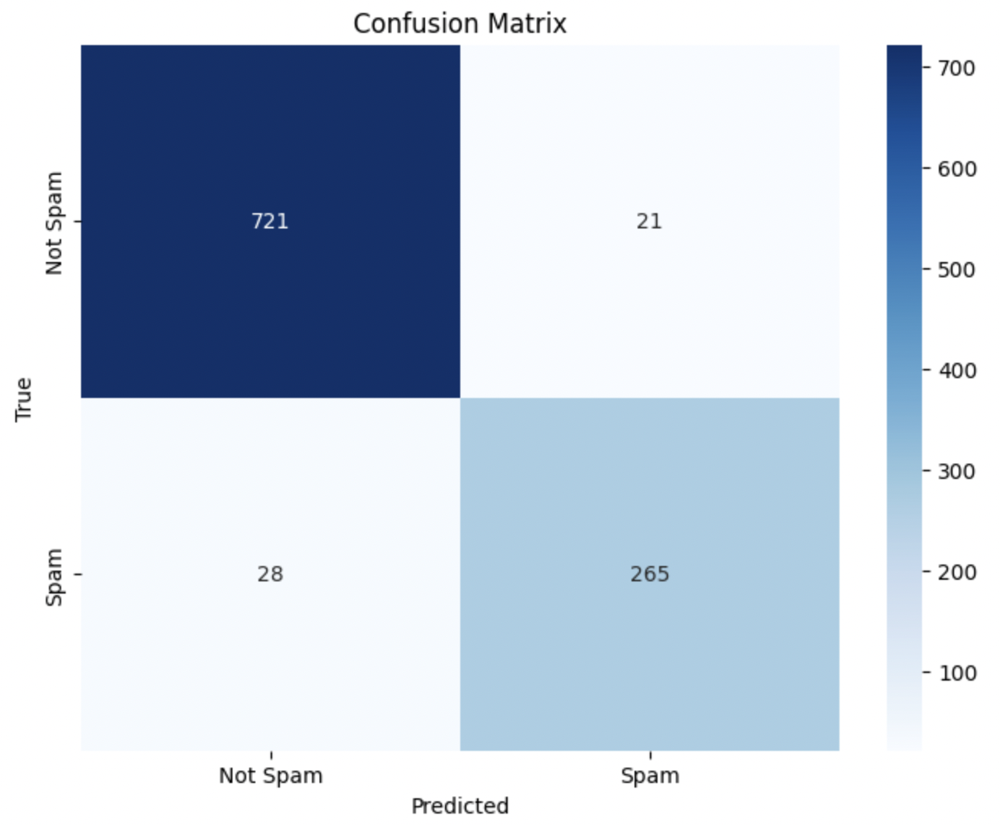

# Spam Detection with LSTM and Attention

This repository contains a Jupyter Notebook project for detecting spam emails using a neural network with LSTM and attention mechanisms. The dataset used for this project is the [Spam Mails Dataset](https://www.kaggle.com/datasets/venky73/spam-mails-dataset) from Kaggle.

## Introduction

This project aims to build a robust spam detection system that can classify emails as spam or not spam. Spam detection is crucial for maintaining the integrity of communication systems and protecting users from malicious content. The neural network model utilized in this project uses LSTM (Long Short-Term Memory) layers and an attention mechanism to effectively capture and analyze the contextual information present in email texts. By doing so, the model can discern subtle patterns and dependencies that are indicative of spam.

## Dataset

The dataset used in this project is the [Spam Mails Dataset](https://www.kaggle.com/datasets/venky73/spam-mails-dataset). It consists of email texts labeled as spam or not spam. The dataset contains a number of spam and non-spam emails, making it suitable for training a binary classification model. The dataset is pre-divided into training and testing sets to facilitate model evaluation.

## Preprocessing

Effective preprocessing is a critical step in preparing the raw text data for training the neural network. The preprocessing steps include:

1. **Text Cleaning**: Removing non-alphabetic characters and converting text to lowercase. This step helps in standardizing the text data, making it easier to process. Non-alphabetic characters such as numbers and punctuation are removed to focus on the actual words.

2. **Tokenization and Stop Word Removal**: Splitting text into individual words and removing common English stop words (e.g., "and", "the", "is"). Tokenization converts the text into a sequence of words, while stop word removal eliminates words that do not contribute significant meaning. This reduces the noise in the data and helps in focusing on the important words.

3. **Lemmatization**: Converting words to their base or root form (e.g., "running" to "run"). Lemmatization helps in reducing the vocabulary size by grouping together different forms of the same word. This is important for reducing complexity and improving the model's ability to generalize.

4. **Text to Sequence Conversion**: Using Keras Tokenizer to convert cleaned text into sequences of integers, where each integer represents a unique word in the vocabulary. This step transforms text data into numerical data that can be used by neural networks. The tokenizer builds a vocabulary of the most frequent words and converts the text into sequences of these words.

5. **Padding Sequences**: Ensuring all sequences have the same length by padding them with zeros. Padding is necessary because neural networks expect inputs of uniform size. Sequences shorter than the maximum length are padded with zeros, while longer sequences are truncated. This ensures that the input to the neural network is consistent.

## Model Architecture

The neural network model is built using PyTorch and includes the following components:

1. **Embedding Layer**: Converts input sequences into dense vectors of fixed size. This layer learns word embeddings, which capture semantic information about the words. The embeddings represent words in a continuous vector space where similar words are mapped to nearby points.

2. **LSTM Layer**: Captures the sequential dependencies in the text data. LSTM (Long Short-Term Memory) is a type of recurrent neural network (RNN) that is particularly effective for sequences with long-term dependencies. It can remember previous words in a sequence and use that information to influence the current word's processing.

3. **Attention Mechanism**: Computes attention weights and produces a context vector by weighted summation of LSTM outputs. The attention mechanism allows the model to focus on important parts of the sequence, enhancing its ability to capture relevant information. This is particularly useful for handling long sequences where not all parts are equally important.

4. **Fully Connected Layers**: Two fully connected layers are used:
   - The first fully connected layer reduces the dimensionality to 128 units and applies ReLU activation. This layer combines the information from the attention mechanism and learns higher-level features.
   - The second fully connected layer outputs a single value with a sigmoid activation for binary classification. The sigmoid activation function maps the output to a probability between 0 and 1, indicating the likelihood of an email being spam.

5. **Dropout Layers**: Added to prevent overfitting by randomly setting a fraction of the input units to zero during training. Dropout helps in regularizing the model and improving its generalization to unseen data.

## Evaluation

The model is evaluated using the F1 score and a confusion matrix to measure its performance.

### F1 Score

The F1 score is a measure of a model's accuracy that considers both precision and recall. It is especially useful for imbalanced datasets, as it provides a single metric that balances the trade-off between precision and recall. Precision measures the proportion of true positive predictions among all positive predictions, while recall measures the proportion of true positive predictions among all actual positives. The F1 score is the harmonic mean of precision and recall.

### Confusion Matrix

The confusion matrix provides a detailed breakdown of the model's performance by showing the true positives, false positives, true negatives, and false negatives. This helps in understanding how well the model is performing in terms of correctly and incorrectly classified instances. A confusion matrix allows us to see the specific types of errors the model is making, which can be valuable for further improving the model.

## Results

The model achieved the following results on the test set:

- **F1 Score**: `0.5987`
- **Confusion Matrix**:
  

The results indicate that the model has learned to distinguish between spam and harmless mails.
